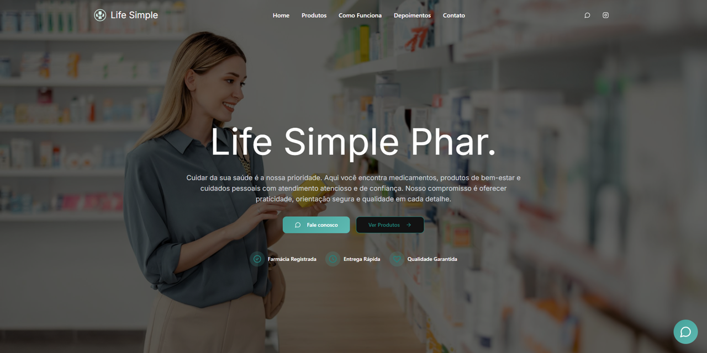

# Life Simple — Farmácia de Manipulação

Landing page one-page responsiva para farmácia de manipulação, com catálogo, FAQ, páginas legais (LGPD), chatbot (Gemini via proxy + Firebase) e conversão via WhatsApp.



## Funcionalidades

- Design responsivo com identidade verde e branco
- Catálogo filtrável (Emagrecimento, Academia, Pele) com busca e empty state
- Modal de produto com CTA WhatsApp
- Chatbot flutuante (lazy) com histórico, rate limit e chave Gemini só no servidor
- Formulário de contato → WhatsApp + consentimento LGPD
- Páginas `/privacidade`, `/termos` e `/lgpd`
- FAQ com schema JSON-LD
- Mapa embed do endereço em Porto Alegre

## Tecnologias

- React 19 + TypeScript (strict) + Vite 8
- Tailwind CSS 4 + shadcn/ui
- Firebase (auth anônima + Firestore)
- Google Gemini via `POST /api/chat` (proxy Vite / servidor Node)
- Vitest

## Como executar

**Pré-requisitos:** Node.js 18+

```bash
git clone <repo-url>
cd Life-Simple
npm install
cp .env.example .env
npm run dev
```

Acesse `http://localhost:8080`.

## Configuração

| Variável | Onde | Descrição |
|---|---|---|
| `VITE_SITE_URL` | Cliente / HTML | URL pública (OG, canonical). Sem barra final. |
| `GEMINI_API_KEY` | **Servidor** | Chave Gemini — **nunca** use prefixo `VITE_` |
| `VITE_FIREBASE_*` | Cliente | Config do projeto Firebase |
| `FIREBASE_PROJECT_ID` | Servidor (opcional) | Project ID para validar ID tokens; default = `VITE_FIREBASE_PROJECT_ID` |
| `TRUST_PROXY` | Servidor (opcional) | `true` para usar `X-Forwarded-For` no rate limit |

Contatos: `src/constants/contact.ts`. Catálogo: `src/data/products.ts`.

### Segurança do chat

A chave Gemini **não** vai para o bundle. `POST /api/chat` exige `Authorization: Bearer <Firebase ID token>`, valida o JWT nas chaves públicas do Firebase, limita body (16 KB) e mensagem (2 000 chars), e aplica rate limit por IP e por `uid`. Em `npm run dev` / `preview` o plugin Vite atende a rota; em produção use `npm run start` ou o mesmo handler no seu backend.

### Firestore

Use as regras em `firestore.rules` (usuário autenticado só acessa `chats/{uid}`). Ative Authentication anônima no console Firebase.

Atualize `public/sitemap.xml` e a linha Sitemap em `public/robots.txt` com o domínio real.

## Estrutura

```
src/
├── components/     # Seções da landing + UI
├── constants/      # Contatos e mapas
├── data/           # Catálogo e FAQ
├── hooks/          # useChat
├── lib/            # format, whatsapp, utils
├── pages/          # Index, legais, 404
├── services/       # firebase, gemini (cliente)
server/             # Proxy Gemini + servidor de produção
plugins/            # Plugin Vite /api/chat
```

## Scripts

| Comando | Descrição |
|---|---|
| `npm run dev` | Dev + proxy `/api/chat` |
| `npm run build` | Typecheck + build |
| `npm run preview` | Preview do build (com proxy) |
| `npm run start` | Serve `dist/` + API (produção local) |
| `npm run lint` | ESLint |
| `npm test` | Vitest |

## Deploy

1. Defina `VITE_SITE_URL` e Firebase no ambiente de build.
2. Defina `GEMINI_API_KEY` apenas no ambiente do servidor/API.
3. `npm run build` e publique `dist/` **junto** com um host que exponha `/api/chat` (ou `npm run start` atrás de um reverse proxy).
